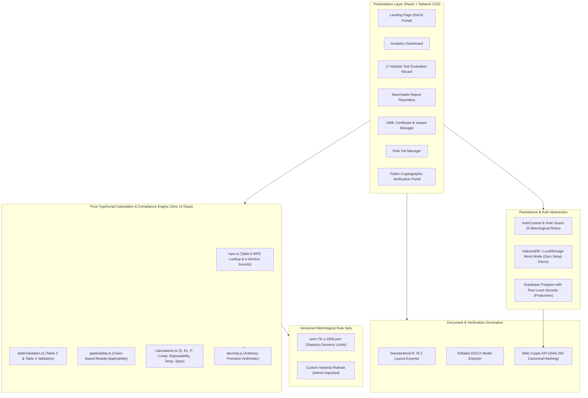
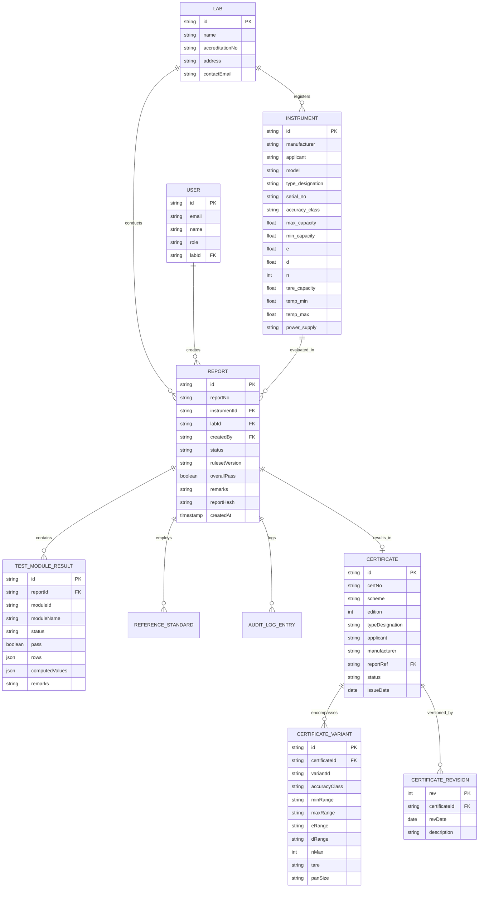

# NAWI Type Evaluation Report System — Architecture Specification

> **Smart India Hackathon 2026** — Problem Statement ID 26035  
> **Organization:** Department of Consumer Affairs (DoCA), Ministry of Consumer Affairs, Food & Public Distribution, Government of India.  
> **Standard:** OIML R 76-1:2006 & OIML R 76-2:1993  

---

## 1. High-Level System Architecture

The application is architected as an offline-first, client-side, zero-latency Web Application built with Vite, React 18, Strict TypeScript, and Tailwind CSS. It features a completely decoupled rules engine with zero UI dependencies, versioned JSON rule sets, dual-layer persistence (automatic local storage/IndexedDB mock mode with optional Supabase backend), and cryptographic SHA-256 document verification.

---

## 2. Entity-Relationship Data Model

The data layer models every metrological pattern evaluation, instrument variation, test result, and statutory certificate under OIML R 76.

---

## 3. Rules Engine Architecture

The rules engine resides in `/src/engine` and is strictly decoupled from the UI:
1. **Decimal-Safe Arithmetic:** Floating point issues (e.g. `0.1 + 0.2 !== 0.3`) are prohibited. All divisions, subtractions, and comparisons in scale interval units $e$ and $d$ are evaluated using `decimal.js` with 20 decimal places of precision.
2. **Versioned Rule Sets:** Numeric parameters (Table 3 $n_{min}, n_{max}$, Table 6 MPE limits, voltage thresholds, tilt bounds, creep tolerances) are loaded from `/src/rulesets/oiml-r76-1-2006.json`. No hardcoded statutory limits exist in component code.
3. **Zod Schema Validation:** New rulesets uploaded by administrators are validated at runtime against `RulesetSchema` before activation.
4. **Tri-State Verdict Logic:** Tests compute a tri-state outcome: `Passed`, `Failed`, or `Not Applicable` (with statutory justification). An overall report cannot be approved if any applicable test fails or remains unverified.
